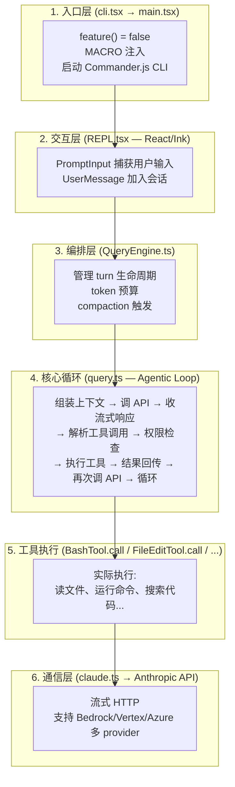

# 第一章：项目概述与背景

## 1.1 一句话定义

Claude Code 是一个**运行在本地终端中的 agentic coding system**。它不是给建议的聊天机器人——它直接在你的项目目录中读代码、改文件、跑命令、调试程序，拥有完整的 shell 能力。

## 1.2 技术定位：terminal-native agentic system

理解 Claude Code 的关键在于三个词：

| 定位关键词                | 含义                                                          |
| ------------------------- | ------------------------------------------------------------- |
| **Terminal-native** | 原生 CLI 应用，不是 IDE 插件、不是 Web 界面、不是 API wrapper |
| **Agentic**         | AI 自主决策工具调用链，不是"一问一答"的聊天模式               |
| **Coding system**   | 面向软件工程全流程，不是通用问答工具                          |

### 与同类工具的架构层面差异

| 工具                  | 架构模式                           | 运行位置    | 工具执行        |
| --------------------- | ---------------------------------- | ----------- | --------------- |
| **Claude Code** | Terminal-native agentic loop       | 本地进程    | 直接 shell 执行 |
| Cursor / Copilot      | IDE-integrated autocomplete + chat | IDE 进程内  | LSP / IDE API   |
| Aider                 | CLI chat → git patch              | 本地进程    | 文件操作为主    |
| ChatGPT / Claude.ai   | Cloud chat + artifacts             | 浏览器/云端 | 沙箱容器        |

核心差异：Claude Code 拥有**完整的 shell 访问权**——这意味着它可以做任何你在终端里能做的事，但也需要对应的安全机制来约束这个能力。

## 1.3 端到端示例：从输入到输出

当你在终端中输入 `bun run dev 有个 TypeScript 报错，帮我修一下` 时，系统发生了什么？



具体到这个报错修复场景，一次典型的 agentic loop 可能包含多轮工具调用：

| Turn | AI 决策          | 工具调用                                | 结果                |
| ---- | ---------------- | --------------------------------------- | ------------------- |
| 1    | 先看报错信息     | `Bash("bun run dev 2>&1 \| head -30")` | TypeScript 错误输出 |
| 2    | 定位到文件       | `Read("src/utils/foo.ts")`            | 源代码内容          |
| 3    | 搜索相关类型定义 | `Grep("interface Foo", "src/")`       | 类型定义位置        |
| 4    | 修复代码         | `FileEdit(old, new)`                  | 代码已修改          |
| 5    | 验证修复         | `Bash("bun run dev 2>&1 \| head -10")` | 编译通过            |

每一步都是 AI 自主决策的——它决定用哪个工具、传什么参数、何时停止。这就是 "agentic" 的含义。

## 1.4 它不是什么

- **不是 IDE 插件**：没有图形界面，不依赖 VS Code 或任何 IDE
- **不是 API wrapper**：它有自己的工具系统、权限模型、上下文工程、会话管理
- **不是聊天机器人**：输出不是纯文本，而是实际的文件修改、命令执行
- **不是无脑执行器**：每个敏感操作都有权限检查和用户确认环节

## 1.5 启动入口解剖

真正的代码入口是 `src/entrypoints/cli.tsx`，它做了三件关键的事：

```typescript
// 1. 注入运行时 polyfill —— feature() 永远返回 false
const feature = (_name: string) => false;

// 2. 注入构建时宏
globalThis.MACRO = { VERSION: "2.1.888", BUILD_TIME: ..., };

// 3. 声明构建目标
globalThis.BUILD_TARGET = "external";  // 外部构建（非 Anthropic 内部）
globalThis.BUILD_ENV = "production";
globalThis.INTERFACE_TYPE = "stdio";   // 标准 I/O 交互
```

然后控制流传递到 `src/main.tsx`：

1. Commander.js 解析命令行参数
2. 初始化认证、遥测、策略限制
3. 加载工具列表（`getTools()`）
4. 启动 REPL（`launchRepl()`）或管道模式（`-p`）

## 1.6 为什么选择终端

终端不是限制，而是选择。它带来了独特的能力：

- **完整的 shell 访问**：可以运行任何命令行工具，无需为每个能力写插件
- **项目原生**：直接在项目目录工作，理解文件系统结构、git 状态
- **可组合性**：管道模式（`echo "..." | claude -p`）允许嵌入 CI/CD 和自动化流程
- **低延迟**：没有 Electron 开销，React/Ink 渲染的 TUI 响应极快

代价是用户需要适应命令行界面——但也正因如此，它吸引的是需要**真正掌控开发环境**的开发者。

## 1.7 项目技术栈

| 技术                   | 选择理由                                    |
| ---------------------- | ------------------------------------------- |
| **Bun**          | 高速 JavaScript 运行时，比 Node.js 启动更快 |
| **Ink**          | React 在终端的渲染引擎，支持 TUI 开发       |
| **TypeScript**   | 完整的类型安全                              |
| **Monorepo**     | Bun workspaces 管理多包                     |
| **Zod**          | 运行时类型验证                              |
| **Commander.js** | CLI 参数解析                                |

## 1.8 项目结构概览

```
claude-code/
├── src/
│   ├── entrypoints/          # 入口点
│   │   ├── cli.tsx          # 🏁 真正的入口（含 polyfill）
│   │   └── init.ts         # 初始化
│   ├── main.tsx             # Commander CLI 定义
│   ├── screens/
│   │   └── REPL.tsx        # 交互界面 (5000+ 行)
│   ├── query.ts             # 🔥 核心查询函数 (1700+ 行)
│   ├── QueryEngine.ts      # 🔥 会话引擎 (1300+ 行)
│   ├── Tool.ts             # 🔥 工具接口定义
│   ├── tools.ts            # 🔥 工具注册表
│   ├── tools/              # 各工具实现
│   │   ├── BashTool/
│   │   ├── AgentTool/
│   │   ├── FileEditTool/
│   │   └── ...
│   ├── ink/                # Ink 终端 UI 框架
│   ├── state/              # 状态管理
│   ├── services/           # 服务层
│   │   ├── api/           # API 客户端
│   │   └── mcp/           # MCP 服务
│   └── utils/              # 工具函数
└── packages/              # Monorepo workspace 包
```
