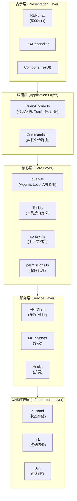
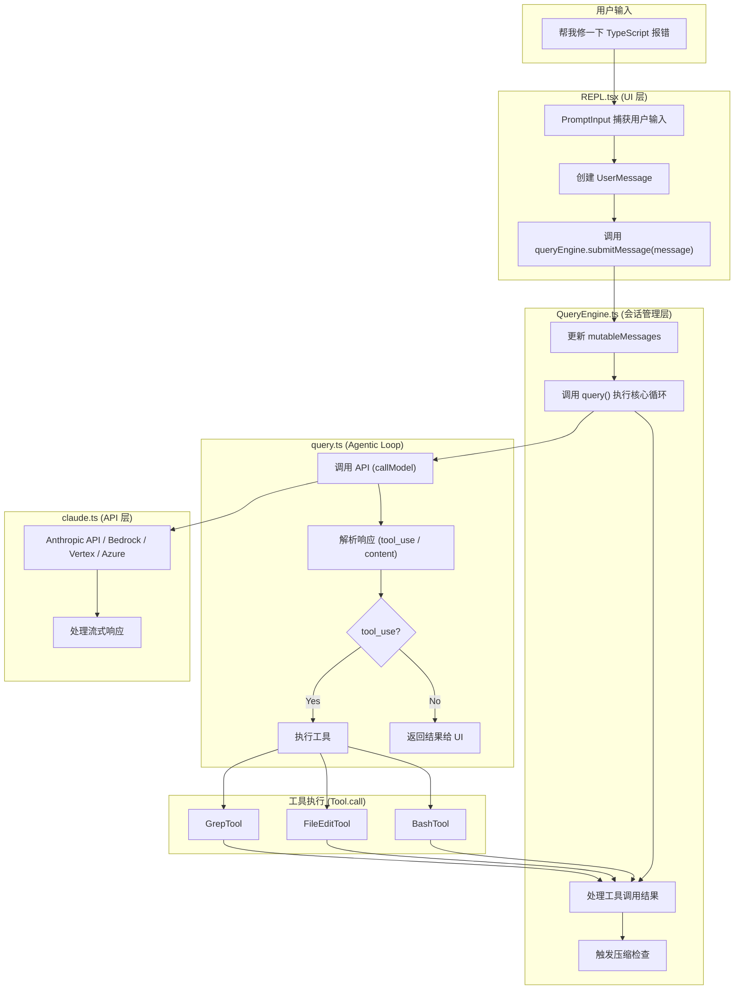
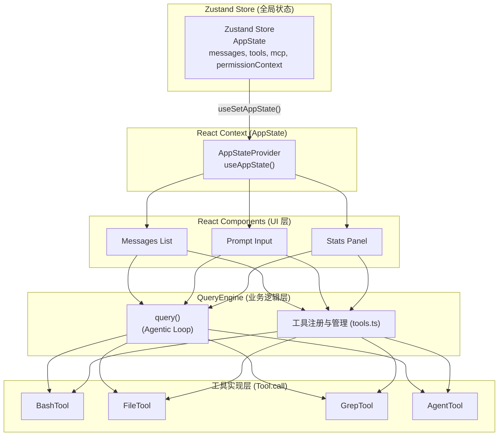
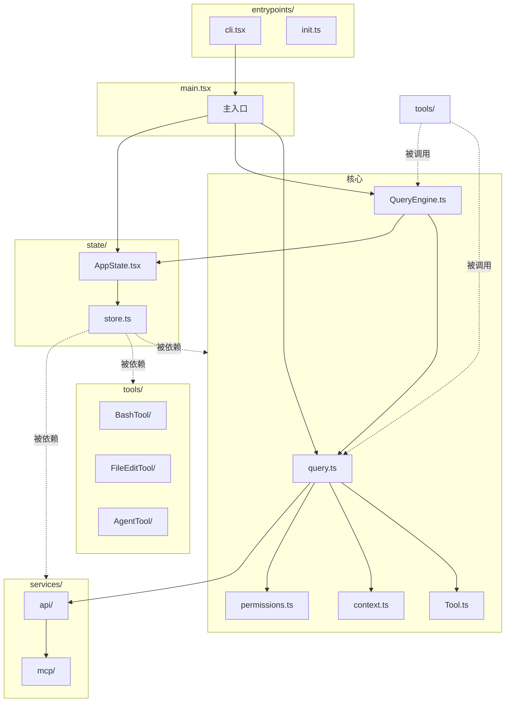

# 第二章：项目架构总览

## 2.1 架构分层概览

Claude Code 采用经典的**分层架构**，各层职责清晰，依赖方向单一：



## 2.2 核心模块职责

### 2.2.1 query.ts — Agentic Loop 引擎

**职责**：实现 AI 与工具调用的核心循环

```typescript
// query.ts 核心逻辑伪代码
async function* query(params: QueryParams) {
  while (true) {
    // 1. 组装上下文
    const messagesForQuery = buildMessages(...)

    // 2. 调用 API (流式)
    for await (const message of callModel(messagesForQuery)) {
      // 3. 解析工具调用
      if (message.type === 'tool_use') {
        // 4. 执行工具
        const result = await executeTool(message)
        // 5. 将结果加入消息
        messages.push(result)
      } else {
        // 6. 转发消息给 UI
        yield message
      }
    }
  }
}
```

**关键特性**：

- 使用 `AsyncGenerator` 实现流式处理
- 支持多轮工具调用循环
- 内置 token 预算管理和压缩触发
- 错误恢复与降级处理

### 2.2.2 QueryEngine.ts — 会话状态管理

**职责**：管理对话会话的完整生命周期

```typescript
export class QueryEngine {
  private mutableMessages: Message[]      // 会话消息历史
  private abortController: AbortController // 中断控制
  private permissionDenials: SDKPermissionDenial[]  // 权限拒绝记录
  private totalUsage: NonNullableUsage    // API 使用统计

  async submitMessage(userMessage: Message) {
    // 1. 处理用户输入
    // 2. 调用 query() 执行 Agentic Loop
    // 3. 处理工具调用结果
    // 4. 更新会话状态
    // 5. 触发必要的压缩
  }
}
```

**关键特性**：

- Turn（对话轮次）管理
- 文件历史快照
- 会话归因（Attribution）
- 压缩（Compaction）协调

### 2.2.3 Tool.ts — 工具接口定义

**职责**：定义所有工具的通用接口和类型

```typescript
export type Tool<Input, Output, P> = {
  name: string
  inputSchema: Input
  call(args: Input, context: ToolUseContext, ...): Promise<ToolResult<Output>>
  description(input: Input, options: {...}): Promise<string>

  // 工具能力声明
  isConcurrencySafe(input: Input): boolean
  isReadOnly(input: Input): boolean
  isDestructive?(input: Input): boolean

  // 权限检查
  checkPermissions(input: Input, context: ToolUseContext): Promise<PermissionResult>

  // UI 渲染
  renderToolResultMessage(content: Output, ...): React.ReactNode
  renderToolUseMessage(input: Partial<Input>, ...): React.ReactNode
}
```

### 2.2.4 tools.ts — 工具注册表

**职责**：注册和组织所有可用工具

```typescript
export function getTools(): Tools {
  return [
    BashTool,
    FileEditTool,
    FileReadTool,
    AgentTool,
    WebSearchTool,
    // ... 50+ 工具
  ]
}
```

**工具分类**：

| 类别                 | 工具                                      | 说明         |
| -------------------- | ----------------------------------------- | ------------ |
| **文件操作**   | FileReadTool, FileEditTool, FileWriteTool | 读写编辑文件 |
| **Shell 执行** | BashTool                                  | 运行命令行   |
| **代码搜索**   | GrepTool, GlobTool                        | 代码搜索定位 |
| **网络**       | WebFetchTool, WebSearchTool               | Web 获取搜索 |
| **子代理**     | AgentTool                                 | 派生新会话   |
| **任务管理**   | TodoWriteTool, TaskCreateTool             | 任务跟踪     |
| **定时**       | CronCreateTool, CronListTool              | 定时任务     |
| **其他**       | AskUserQuestionTool, SkillTool            | 交互和技能   |

## 2.3 数据流架构

### 2.3.1 典型对话流程



### 2.3.2 状态管理数据流



## 2.4 扩展性设计

### 2.4.1 工具扩展

新增工具只需：

1. 实现 `Tool` 接口
2. 在 `tools.ts` 中注册
3. 定义 `prompt()` 返回工具描述

### 2.4.2 Hook 扩展

```typescript
// Hook 类型定义
type Hook = {
  name: string
  run(params: {
    toolName: string
    toolInput: unknown
    context: ToolUseContext
  }): Promise<HookResult>
}

// 使用方式
// settings.json
{
  "hooks": {
    "preToolUse": [
      { "name": "my-hook", "match": "Bash*" }
    ]
  }
}
```

### 2.4.3 MCP 扩展

```typescript
// MCP 服务器连接
const mcpServer: MCPServerConnection = {
  type: 'stdio',
  command: 'npx',
  args: ['-y', '@modelcontextprotocol/server-filesystem', './projects']
}

// 工具自动从 MCP 服务器加载
const tools = await getMcpTools(mcpServer)
```

## 2.5 关键设计模式

### 2.5.1 Generator Pattern (query.ts)

使用 `AsyncGenerator` 实现流式处理，允许边接收边处理：

```typescript
async function* query(params) {
  const response = await fetch(...)
  for await (const chunk of response) {
    const event = parseEvent(chunk)
    yield event  // 立即 yield 给调用者
  }
}
```

### 2.5.2 Strategy Pattern (Tool System)

不同工具实现不同策略，但接口统一：

```typescript
// 所有工具都实现相同的 call() 接口
interface Tool {
  call(args: Input, context: ToolUseContext): Promise<ToolResult>
}

// 但内部实现各异
class BashTool {
  async call(args, context) {
    // Shell 执行策略
  }
}

class FileEditTool {
  async call(args, context) {
    // 文件编辑策略
  }
}
```

### 2.5.3 State Machine (Query Transitions)

```typescript
type Terminal =
  | { reason: 'done' }
  | { reason: 'stop_hook_retry' }
  | { reason: 'max_turns' }
  | { reason: 'blocked' }
  | { reason: 'error', error: Error }
```

### 2.5.4 Observer Pattern (AppState)

Zustand store 支持订阅状态变化：

```typescript
const store = createStore()

// 订阅
store.subscribe((state) => {
  console.log('messages changed:', state.messages.length)
})

// 发布
store.setState({ messages: [...state.messages, newMessage] })
```

## 2.6 模块依赖图



## 2.7 总结

Claude Code 的架构设计体现了几个核心原则：

| 原则               | 体现                           |
| ------------------ | ------------------------------ |
| **单一职责** | 每个模块只做一件事             |
| **依赖倒置** | 高层模块不依赖低层模块细节     |
| **开闭原则** | 工具系统对扩展开放，对修改封闭 |
| **流式处理** | AsyncGenerator 实现边收边处理  |
| **状态集中** | Zustand store 统一管理全局状态 |
