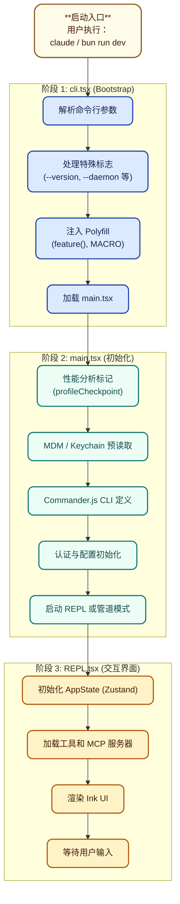
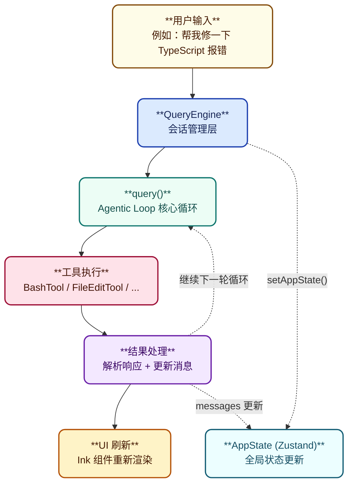

# 第三章：入口与启动流程

## 3.1 启动流程概览

Claude Code 的启动是一个精心设计的**多阶段过程**，每个阶段都有明确的职责：



## 3.2 cli.tsx — Bootstrap 入口

**文件位置**：src/entrypoints/cli.tsx

### 3.2.1 Polyfill 注入

cli.tsx 是真正的入口文件，它在加载任何其他模块之前注入关键的 polyfill：

```typescript
// cli.tsx 顶部注入

// 1. feature() polyfill — 所有特性标志返回 false
const feature = (_name: string) => false;

// 2. MACRO 全局变量 — 模拟构建时宏注入
globalThis.MACRO = {
  VERSION: "2.1.888",
  BUILD_TIME: "...",
};

// 3. 构建目标声明
globalThis.BUILD_TARGET = "external";  // vs "ant" (Anthropic 内部)
globalThis.BUILD_ENV = "production";
globalThis.INTERFACE_TYPE = "stdio";
```

**为什么需要 Polyfill？**

原始 Claude Code 使用 `bun:bundle` 在构建时注入这些值，但反编译版本无法访问构建时上下文，所以需要在运行时模拟。

### 3.2.2 快速路径优化

cli.tsx 实现了多个**快速路径**来加速常见操作：

```typescript
async function main(): Promise<void> {
  const args = process.argv.slice(2);

  // 快速路径 1: --version
  if (args.length === 1 && (args[0] === "--version" || args[0] === "-v")) {
    console.log(`${MACRO.VERSION} (Claude Code)`);
    return;  // 零模块加载！
  }

  // 快速路径 2: MCP 服务器模式
  if (process.argv[2] === "--claude-in-chrome-mcp") {
    const { runClaudeInChromeMcpServer } = await import("../utils/claudeInChrome/mcpServer.js");
    await runClaudeInChromeMcpServer();
    return;
  }

  // ... 更多快速路径

  // 默认路径: 加载完整 CLI
  const { main: cliMain } = await import("../main.jsx");
  await cliMain();
}
```

| 快速路径                   | 命令             | 避免加载的模块 |
| -------------------------- | ---------------- | -------------- |
| `--version`              | 版本查询         | 零导入         |
| `--claude-in-chrome-mcp` | Chrome MCP       | main.tsx       |
| `--daemon-worker`        | 守护进程工作进程 | 配置、认证     |
| `remote-control`         | 远程控制         | 完整 CLI       |

### 3.2.3 Feature Flag 条件分支

cli.tsx 中有大量的 `feature('XXX')` 条件检查，这些在原始版本中由 GrowthBook A/B 测试控制：

```typescript
// DAEMON 模式守护进程
if (feature("DAEMON") && args[0] === "daemon") {
  const { daemonMain } = await import("../daemon/main.js");
  await daemonMain(args.slice(1));
  return;
}

// 后台会话管理
if (
  feature("BG_SESSIONS") &&
  (args[0] === "ps" || args[0] === "logs" || ...)
) {
  const bg = await import("../cli/bg.js");
  await bg.psHandler(args.slice(1));
  return;
}

// 模板任务
if (feature("TEMPLATES") && (args[0] === "new" || ...)) {
  const { templatesMain } = await import("../cli/handlers/templateJobs.js");
  await templatesMain(args);
  return;
}
```

由于 polyfill 使所有 `feature()` 返回 `false`，这些代码路径永远不会执行——这是反编译版本的一个已知限制。

## 3.3 main.tsx — 初始化与 CLI 定义

**文件位置**：src/main.tsx

### 3.3.1 模块级副作用

main.tsx 的导入部分包含了**必须在任何其他代码之前执行**的副作用：

```typescript
// main.tsx 导入部分

// 1. 性能分析入口标记
profileCheckpoint('main_tsx_entry');

// 2. MDM (Mobile Device Management) 预读取
// 在后台启动 MDM 查询，不阻塞主线程
startMdmRawRead();

// 3. Keychain 预读取
// 并行读取 macOS Keychain 中的 OAuth 和 API 密钥
startKeychainPrefetch();
```

**为什么并行执行？**

这些读取操作原本是串行的，总耗时约 65ms。并行化后可以显著减少启动时间。

### 3.3.2 Commander.js CLI 定义

main.tsx 使用 Commander.js 定义完整的 CLI 结构：

```typescript
// Commander 命令树
const program = new Command()

program
  .name('claude')
  .description('Claude Code CLI')
  .addOption(new Option('--no-input').hideHelp())
  .addCommand(createMcpCommand())
  .addCommand(createAuthCommand())
  .addCommand(createPluginCommand())
  .addCommand(createDoctorCommand())

// 主命令 (默认)
program.action(async (options) => {
  // 1. 初始化
  await init()

  // 2. 加载工具
  const tools = await getTools()

  // 3. 启动 REPL
  await launchRepl({
    tools,
    cwd: options.cwd,
    // ...
  })
})

// 管道模式 (-p)
if (process.stdin.isTTY === false) {
  await runPipeMode()
}
```

### 3.3.3 初始化序列

main.tsx 的 `main()` 函数执行关键的初始化步骤：

```typescript
async function main() {
  // 1. 初始化配置
  enableConfigs()

  // 2. 初始化认证
  const auth = await initializeAuth()

  // 3. 初始化遥测
  initializeTelemetryAfterTrust()

  // 4. 加载策略限制
  await loadPolicyLimits()

  // 5. 加载 MCP 服务器配置
  const mcpServers = await loadMcpServers()

  // 6. 加载插件
  await loadPlugins()

  // 7. 加载工具
  const tools = await getTools()

  // 8. 启动 REPL
  await launchRepl({ tools, mcpServers, ... })
}
```

## 3.4 REPL.tsx — 交互界面

**文件位置**：src/screens/REPL.tsx

### 3.4.1 组件结构

REPL.tsx 是最大的单一文件组件（约 5000+ 行），它包含整个交互界面的实现：

```typescript
// REPL.tsx 核心结构
export function REPL({ config }: REPLProps) {
  // 状态
  const [messages, setMessages] = useState<Message[]>([])
  const [isLoading, setIsLoading] = useState(false)

  // 工具
  const tools = useMergedTools()
  const mcpClients = useMergedClients()

  // 子代理
  const { agents } = useAgentDefinitions()

  // Hooks
  const canUseTool = useCanUseTool()
  const queryEngine = useQueryEngine()

  // 渲染
  return (
    <Box>
      <Messages messages={messages} />
      <SpinnerWithVerb isLoading={isLoading} />
      <PromptInput
        onSubmit={handleSubmit}
        onCancel={handleCancel}
      />
    </Box>
  )
}
```

### 3.4.2 QueryEngine 初始化

```typescript
const queryEngine = useMemo(() => {
  return new QueryEngine({
    cwd: config.cwd,
    tools: mergeAndFilterTools(builtInTools, mcpTools, skillTools),
    commands: getCommands(),
    mcpClients,
    agents,
    canUseTool,
    getAppState,
    setAppState,
    // ...
  })
}, [])
```

### 3.4.3 消息处理流程

```typescript
async function handleSubmit(input: string) {
  // 1. 创建用户消息
  const userMessage = createUserMessage({
    content: input,
    source: 'user',
  })

  // 2. 更新 UI
  setMessages(prev => [...prev, userMessage])
  setIsLoading(true)

  // 3. 调用 QueryEngine
  try {
    for await (const event of queryEngine.submitMessage(userMessage)) {
      if (isStreamEvent(event)) {
        // 处理流式事件
        handleStreamEvent(event)
      } else if (isMessage(event)) {
        // 处理消息
        handleMessage(event)
      }
    }
  } finally {
    setIsLoading(false)
  }
}
```

## 3.5 状态初始化

### 3.5.1 AppState 结构

```typescript
interface AppState {
  // 消息
  messages: Message[]

  // 工具
  tools: Tools
  builtinTools: Tools
  mcpTools: Tools
  skillTools: Tools

  // MCP
  mcp: {
    clients: MCPServerConnection[]
    resources: Record<string, ServerResource[]>
  }

  // 权限
  toolPermissionContext: ToolPermissionContext

  // 会话
  sessionId: string
  conversationId: string

  // 配置
  fastMode: boolean
  effortValue: number
  model: string
}
```

### 3.5.2 状态更新流程



## 3.6 特殊启动模式

### 3.6.1 管道模式 (Pipe Mode)

```bash
echo "帮我写一个 hello world" | claude -p
```

管道模式跳过了 REPL UI，直接从 stdin 读取输入并输出结果：

```typescript
// cli.tsx
if (args.includes("-p")) {
  const input = await readStdin()
  await runPipeMode(input)
}
```

### 3.6.2 非交互模式 (SDK/Agent 模式)

```typescript
// 通过 SDK 启动
const client = new ClaudeCode({
  sessionId: 'my-session',
})

await client.start()
await client.userMessage("帮我修一下这个 bug")
```

## 3.7 启动性能优化

Claude Code 采用了多种启动性能优化策略：

| 优化                 | 实现                              | 效果                 |
| -------------------- | --------------------------------- | -------------------- |
| **延迟导入**   | `await import()` 在需要时才加载 | 减少初始 bundle 大小 |
| **快速路径**   | `--version` 等零导入路径        | 常用操作秒级响应     |
| **并行预读取** | MDM + Keychain 并行读取           | 节省\~65ms           |
| **代码分割**   | Bun.build 的动态导入支持          | 按需加载             |
| **虚拟列表**   | 只渲染可见消息                    | 大量历史时保持流畅   |

## 3.8 总结

启动流程的关键设计点：

1. **分层入口**：cli.tsx 处理快速路径，main.tsx 处理完整初始化
2. **Polyfill 注入**：在模块加载前准备好模拟环境
3. **Feature Flag 架构**：支持灰度发布和 A/B 测试
4. **并行初始化**：最大化利用启动时间
5. **Generator 模式**：流式处理用户输入，无需等待完整响应
