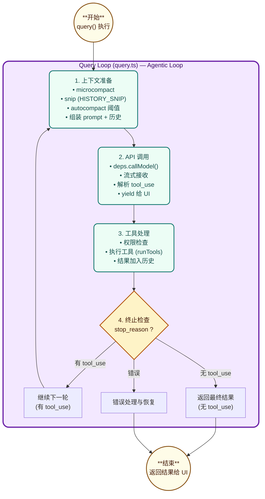
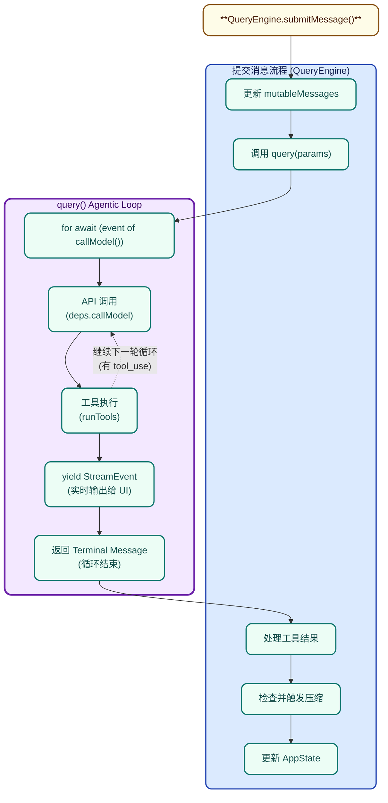

# 第四章：核心查询引擎 (query.ts)

## 4.1 概述

`query.ts` 是 Claude Code 的**核心引擎**，实现了 AI 与工具调用的完整循环。它是连接用户意图、API 推理和工具执行的桥梁。

**文件位置**：src/query.ts

**代码规模**：\~1700 行

**核心职责**：

1. 管理 Agentic Loop（AI → 工具 → AI → 工具 → ...）
2. 处理流式 API 响应
3. 协调工具执行
4. 管理 token 预算和压缩
5. 错误恢复与降级

## 4.2 核心设计：AsyncGenerator 模式

query.ts 使用 **AsyncGenerator** 模式实现流式处理：

```typescript
// query.ts 核心签名
export async function* query(
  params: QueryParams,
): AsyncGenerator<
  | StreamEvent      // API 流式事件
  | RequestStartEvent
  | Message          // 消息
  | TombstoneMessage //墓碑消息（用于删除）
  | ToolUseSummaryMessage,
  Terminal           // 终止状态
> {
  // AsyncGenerator 允许：
  // 1. 边接收 API 响应边 yield 给调用者
  // 2. 在 yield 时执行工具调用
  // 3. 最后返回终止状态
}
```

**为什么用 AsyncGenerator？**

| 方案                     | 优点                 | 缺点             |
| ------------------------ | -------------------- | ---------------- |
| **AsyncGenerator** | 边收边处理、内存高效 | 代码复杂度高     |
| Promise.all              | 并行处理简单         | 需要等待全部完成 |
| 回调函数                 | 无需等待             | 回调地狱         |

## 4.3 Agentic Loop 流程图



## 4.4 核心参数

### 4.4.1 QueryParams

```typescript
export type QueryParams = {
  messages: Message[]                    // 当前会话消息
  systemPrompt: SystemPrompt             // 系统提示
  userContext: { [k: string]: string }   // 用户上下文
  systemContext: { [k: string]: string }  // 系统上下文
  canUseTool: CanUseToolFn               // 工具使用检查
  toolUseContext: ToolUseContext         // 工具执行上下文
  fallbackModel?: string                 // 备用模型
  querySource: QuerySource                // 查询来源
  maxOutputTokensOverride?: number
  maxTurns?: number                      // 最大轮次
  skipCacheWrite?: boolean
  taskBudget?: { total: number }         // API task budget
  deps?: QueryDeps                       // 依赖注入
}
```

### 4.4.2 ToolUseContext

```typescript
export type ToolUseContext = {
  options: {
    commands: Command[]
    debug: boolean
    mainLoopModel: string
    tools: Tools
    verbose: boolean
    thinkingConfig: ThinkingConfig
    mcpClients: MCPServerConnection[]
    mcpResources: Record<string, ServerResource[]>
    isNonInteractiveSession: boolean
    agentDefinitions: AgentDefinitionsResult
  }
  abortController: AbortController
  readFileState: FileStateCache
  getAppState(): AppState
  setAppState(f: (prev: AppState) => AppState): void
  // ... 更多回调
}
```

## 4.5 上下文构建

### 4.5.1 消息预处理

```typescript
// 获取压缩边界后的消息
let messagesForQuery = [...getMessagesAfterCompactBoundary(messages)]

// 应用 microcompact (缓存编辑)
const microcompactResult = await deps.microcompact(
  messagesForQuery,
  toolUseContext,
  querySource,
)
messagesForQuery = microcompactResult.messages

// 应用 snip (历史裁剪)
if (feature('HISTORY_SNIP')) {
  const snipResult = snipModule!.snipCompactIfNeeded(messagesForQuery)
  messagesForQuery = snipResult.messages
  if (snipResult.boundaryMessage) {
    yield snipResult.boundaryMessage
  }
}

// 应用 context collapse
if (feature('CONTEXT_COLLAPSE')) {
  const collapseResult = await contextCollapse.applyCollapsesIfNeeded(...)
  messagesForQuery = collapseResult.messages
}
```

### 4.5.2 系统提示组装

```typescript
const fullSystemPrompt = asSystemPrompt(
  appendSystemContext(systemPrompt, systemContext)
)
```

## 4.6 API 调用

### 4.6.1 callModel 接口

```typescript
// deps.callModel 是依赖注入的 API 调用函数
for await (const message of deps.callModel({
  messages: prependUserContext(messagesForQuery, userContext),
  systemPrompt: fullSystemPrompt,
  tools: toolUseContext.options.tools,
  signal: toolUseContext.abortController.signal,
  options: {
    model: currentModel,
    fallbackModel,
    querySource,
    agents: toolUseContext.options.agentDefinitions.activeAgents,
    maxOutputTokensOverride,
    // ...
  },
})) {
  // 处理每个流式事件
  yield message
}
```

### 4.6.2 流式事件处理

```typescript
for await (const message of deps.callModel({ ... })) {
  // 1. 转发消息给 UI（除非被 withheld）
  if (!withheld) {
    yield yieldMessage
  }

  // 2. 解析 tool_use blocks
  if (message.type === 'assistant') {
    const assistantMessage = message as AssistantMessage
    const toolUseBlocks = extractToolUseBlocks(assistantMessage)

    // 3. 流式工具执行
    if (streamingToolExecutor) {
      for (const toolBlock of toolUseBlocks) {
        streamingToolExecutor.addTool(toolBlock, assistantMessage)
      }

      // 立即 yield 已完成的工具结果
      for (const result of streamingToolExecutor.getCompletedResults()) {
        if (result.message) {
          yield result.message
          toolResults.push(result.message)
        }
      }
    }
  }
}
```

## 4.7 工具执行

### 4.7.1 权限检查

在执行任何工具之前，系统会进行多层权限检查：

```typescript
// 检查权限
const permissionResult = await canUseTool({
  tool: tool.name,
  input: toolInput,
  context: toolUseContext,
})

if (permissionResult.behavior === 'deny') {
  // 返回拒绝消息
  yield createToolResultMessage({
    toolUseId: toolUseId,
    content: `Permission denied: ${permissionResult.reason}`,
    is_error: true,
  })
  continue
}
```

### 4.7.2 工具调用

```typescript
// runTools 是核心工具执行函数
const toolResult = await runTools({
  tools: toolUseContext.options.tools,
  toolUseBlocks,
  context: toolUseContext,
  canUseTool,
})

// 将工具结果加入消息
for (const result of toolResult.results) {
  messages.push(result)
  toolResults.push(result)
}
```

## 4.8 错误处理与恢复

### 4.8.1 可恢复错误

```typescript
// 1. max_output_tokens 错误
if (isWithheldMaxOutputTokens(message)) {
  // 等待恢复循环
  withheld = true
}

// 2. prompt_too_long 错误 (通过 reactive compact)
if (reactiveCompact?.isWithheldPromptTooLong(message)) {
  withheld = true
}

// 3. 媒体大小错误
if (mediaRecoveryEnabled && reactiveCompact?.isWithheldMediaSizeError(message)) {
  withheld = true
}
```

### 4.8.2 模型降级

```typescript
try {
  for await (const message of deps.callModel({ model: currentModel, ... })) {
    // ...
  }
} catch (innerError) {
  if (innerError instanceof FallbackTriggeredError && fallbackModel) {
    // 切换到备用模型
    currentModel = fallbackModel
    attemptWithFallback = true
    continue  // 重试
  }
  throw innerError
}
```

## 4.9 Token 预算管理

### 4.9.1 自动压缩

```typescript
const { compactionResult, consecutiveFailures } = await deps.autocompact(
  messagesForQuery,
  toolUseContext,
  { systemPrompt, userContext, systemContext },
  querySource,
  tracking,
  snipTokensFreed,
)

if (compactionResult) {
  // 压缩成功，应用压缩后的消息
  const postCompactMessages = buildPostCompactMessages(compactionResult)
  for (const message of postCompactMessages) {
    yield message
  }
  messagesForQuery = postCompactMessages

  // 重置追踪状态
  tracking = {
    compacted: true,
    turnId: deps.uuid(),
    turnCounter: 0,
    consecutiveFailures: 0,
  }
}
```

### 4.9.2 阻塞检查

```typescript
if (!compactionResult && querySource !== 'compact') {
  const { isAtBlockingLimit } = calculateTokenWarningState(
    tokenCountWithEstimation(messagesForQuery),
    toolUseContext.options.mainLoopModel,
  )

  if (isAtBlockingLimit) {
    yield createAssistantAPIErrorMessage({
      content: PROMPT_TOO_LONG_ERROR_MESSAGE,
      error: 'invalid_request',
    })
    return { reason: 'blocking_limit' }
  }
}
```

## 4.10 终止状态

```typescript
type Terminal =
  | { reason: 'done' }                           // 正常完成
  | { reason: 'stop_hook_retry' }                 // stop hook 重试
  | { reason: 'max_turns' }                       // 达到最大轮次
  | { reason: 'blocked' }                         // token 超过限制
  | { reason: 'error', error: Error }            // 错误
  | { reason: 'image_error' }                     // 图片错误
  | { reason: 'model_error', error: Error }     // 模型错误
  | { reason: 'interrupted' }                    // 用户中断
```

## 4.11 代码片段解析

### 4.11.1 工具结果归一化

```typescript
// 工具结果需要归一化才能传给 API
toolResults.push(
  ...normalizeMessagesForAPI(
    [result.message],
    toolUseContext.options.tools,
  ).filter(_ => _.type === 'user')  // 只保留 user 类型的消息
)
```

### 4.11.2 墓碑消息处理

```typescript
// 当流式降级发生时，需要删除孤儿消息
if (streamingFallbackOccured) {
  for (const msg of assistantMessages) {
    yield { type: 'tombstone' as const, message: msg }
  }
  // 清空状态准备重试
  assistantMessages.length = 0
  toolResults.length = 0
  toolUseBlocks.length = 0
}
```

### 4.11.3 Skill 发现预取

```typescript
// 技能发现预取在工具执行期间并行运行
const pendingSkillPrefetch = skillPrefetch?.startSkillDiscoveryPrefetch(
  null,
  messages,
  toolUseContext,
)
```

## 4.12 性能优化

### 4.12.1 内存优化

```typescript
// 创建 fetch wrapper 一次避免内存保留
const dumpPromptsFetch = config.gates.isAnt
  ? createDumpPromptsFetch(toolUseContext.agentId ?? config.sessionId)
  : undefined

// 每次调用只保留最新的请求体 (~700KB)
// 而不是所有请求体 (~500MB)
```

### 4.12.2 并行执行

```typescript
// 多个预取任务并行运行
using pendingMemoryPrefetch = startRelevantMemoryPrefetch(...)
const pendingSkillPrefetch = skillPrefetch?.startSkillDiscoveryPrefetch(...)

// 流式工具执行
streamingToolExecutor = new StreamingToolExecutor(...)
```

## 4.13 与 QueryEngine 的关系



## 4.14 总结

query.ts 的核心设计要点：

| 设计点                   | 实现                              | 价值               |
| ------------------------ | --------------------------------- | ------------------ |
| **AsyncGenerator** | 流式 API 响应                     | 边收边处理，低延迟 |
| **依赖注入**       | deps 参数                         | 可测试性，模块解耦 |
| **多层压缩**       | microcompact + autocompact + snip | 控制 token 消耗    |
| **流式工具执行**   | StreamingToolExecutor             | 工具结果快速返回   |
| **错误恢复**       | 降级模型 + 墓碑消息               | 优雅降级           |
| **权限检查**       | canUseTool 回调                   | 安全执行           |
