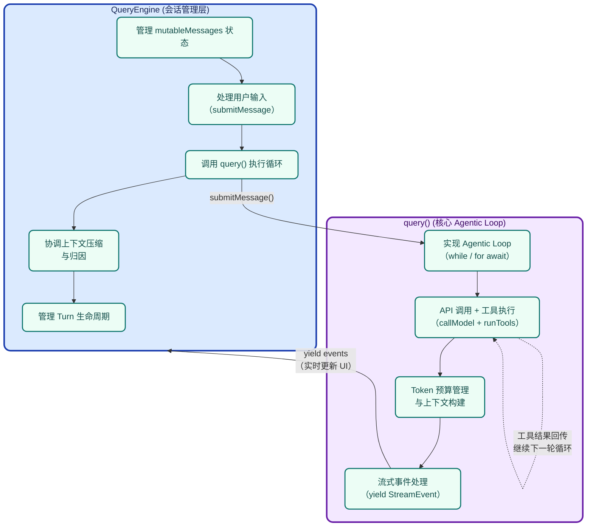
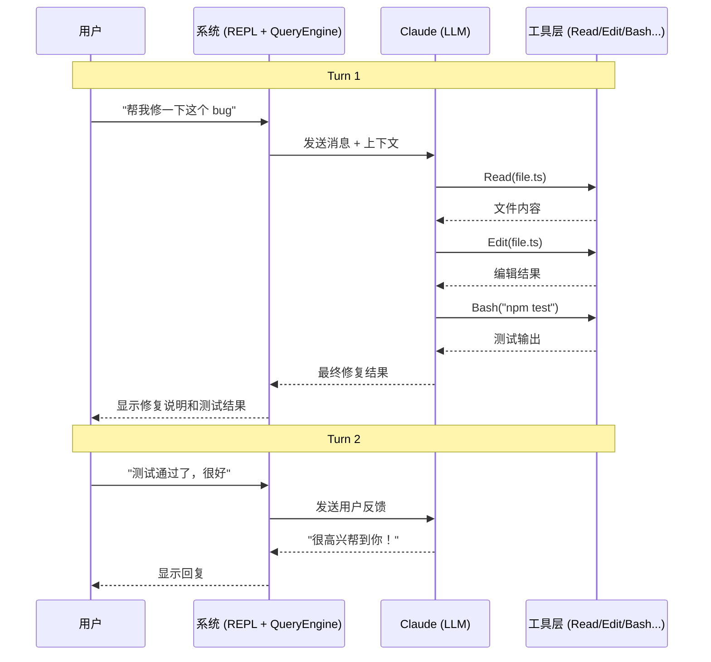
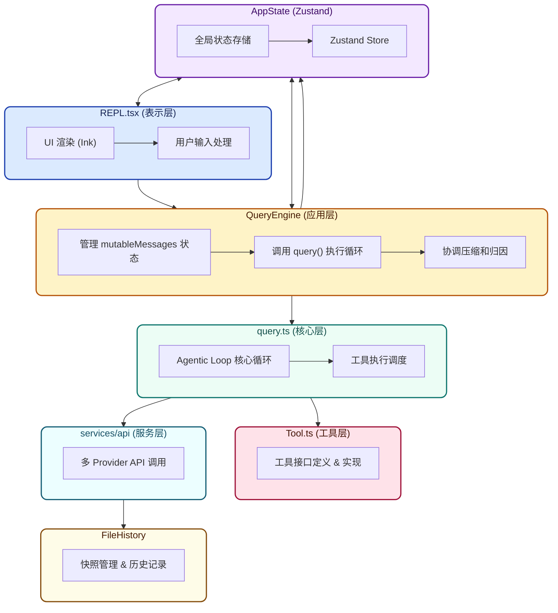

# 第五章：会话引擎 (QueryEngine.ts)

## 5.1 概述

**文件位置**：src/QueryEngine.ts

**代码规模**：\~1300 行

**核心职责**：

1. 管理对话会话的完整生命周期
2. 处理用户消息提交
3. 协调 query() 执行
4. 管理文件历史快照
5. 会话归因（Attribution）
6. 压缩触发协调

## 5.2 与 query.ts 的区别

| 模块                     | 职责                  | 层级       |
| ------------------------ | --------------------- | ---------- |
| **query.ts**       | Agentic Loop 核心逻辑 | 工具执行层 |
| **QueryEngine.ts** | 会话状态编排          | 应用编排层 |



## 5.3 核心类结构

```typescript
export class QueryEngine {
  // 配置
  private config: QueryEngineConfig

  // 会话状态
  private mutableMessages: Message[]      // 可变的消息历史
  private abortController: AbortController // 中断控制器
  private permissionDenials: SDKPermissionDenial[]  // 权限拒绝记录

  // 统计
  private totalUsage: NonNullableUsage    // API 使用统计

  // 文件状态
  private readFileState: FileStateCache   // 文件读取缓存

  // 技能发现
  private discoveredSkillNames = new Set<string>()
  private loadedNestedMemoryPaths = new Set<string>()

  // 核心方法
  async submitMessage(userMessage: Message): Promise<SubmitMessageResult>
  private handleQueryEvents(event: StreamEvent | Message): Promise<void>
  private afterQueryLoopCleanup(): Promise<void>
}
```

## 5.4 配置结构

```typescript
export type QueryEngineConfig = {
  cwd: string
  tools: Tools
  commands: Command[]
  mcpClients: MCPServerConnection[]
  agents: AgentDefinition[]
  canUseTool: CanUseToolFn
  getAppState: () => AppState
  setAppState: (f: (prev: AppState) => AppState) => void
  initialMessages?: Message[]
  readFileCache: FileStateCache
  customSystemPrompt?: string
  appendSystemPrompt?: string
  userSpecifiedModel?: string
  fallbackModel?: string
  thinkingConfig?: ThinkingConfig
  maxTurns?: number
  maxBudgetUsd?: number
  taskBudget?: { total: number }
  jsonSchema?: Record<string, unknown>
  verbose?: boolean
  replayUserMessages?: boolean
  handleElicitation?: ToolUseContext['handleElicitation']
  includePartialMessages?: boolean
  setSDKStatus?: (status: SDKStatus) => void
  abortController?: AbortController
  orphanedPermission?: OrphanedPermission
  snipReplay?: (yieldedSystemMsg: Message, store: Message[]) => ...
}
```

## 5.5 submitMessage 流程

```typescript
async submitMessage(userMessage: Message): Promise<SubmitMessageResult> {
  // 1. 追加用户消息
  this.mutableMessages.push(userMessage)

  // 2. 初始化或恢复状态
  if (!this.abortController) {
    this.abortController = new AbortController()
  }

  // 3. 检查 turn 限制
  const currentTurn = this.getCurrentTurn()
  if (this.config.maxTurns && currentTurn >= this.config.maxTurns) {
    return { reason: 'max_turns' }
  }

  // 4. 构建查询参数
  const queryParams = this.buildQueryParams(userMessage)

  // 5. 调用 query() 并处理事件
  for await (const event of query(queryParams)) {
    await this.handleQueryEvents(event)
  }

  // 6. 后处理
  await this.afterQueryLoopCleanup()

  return { reason: 'done' }
}
```

## 5.6 事件处理

### 5.6.1 消息事件

```typescript
private async handleQueryEvents(event: StreamEvent | Message): Promise<void> {
  if (isTombstoneMessage(event)) {
    // 墓碑消息 - 删除孤儿消息
    this.removeMessage(event.message.uuid)
  } else if (isToolUseSummaryMessage(event)) {
    // 工具使用摘要
    this.handleToolUseSummary(event)
  } else if (isCompactBoundaryMessage(event)) {
    // 压缩边界
    this.handleCompactBoundary(event)
  } else if (isProgressMessage(event)) {
    // 进度消息 - 更新 UI
    this.updateProgress(event)
  } else if (isAssistantMessage(event)) {
    // 助手消息
    this.handleAssistantMessage(event)
  } else if (isUserMessage(event)) {
    // 用户消息（通常是工具结果）
    this.handleUserMessage(event)
  }
}
```

### 5.6.2 消息添加

```typescript
private addMessage(msg: Message): void {
  // 检查重复
  if (this.mutableMessages.some(m => m.uuid === msg.uuid)) {
    return
  }

  // 添加消息
  this.mutableMessages.push(msg)

  // 更新 AppState
  this.config.setAppState(prev => ({
    ...prev,
    messages: [...this.mutableMessages],
  }))
}
```

## 5.7 Turn 管理

### 5.7.1 Turn 概念

一个 **Turn** 是指用户发送一条消息，AI 响应并可能执行多轮工具调用的完整过程：



### 5.7.2 Turn 状态追踪

```typescript
// QueryEngine 内部追踪
private currentTurnId: string
private turnCounter: number = 0
private turnsSinceLastCompact: number = 0

// 每个 turn 开始时
startTurn() {
  this.turnId = generateUUID()
  this.turnCounter++
  this.turnsSinceLastCompact++
}

// turn 结束时
endTurn() {
  // 检查是否需要压缩
  if (this.turnsSinceLastCompact >= AUTO_COMPACT_THRESHOLD) {
    this.triggerCompaction()
  }
}
```

## 5.8 文件历史快照

### 5.8.1 为什么要快照

Claude Code 需要追踪对话期间文件的变化，以便：

1. 支持 `/diff` 命令查看变更
2. 支持 `/clear` 清除历史但保留文件状态
3. 支持会话恢复

### 5.8.2 快照机制

```typescript
private async updateFileHistory(change: FileChange): Promise<void> {
  const snapshot = fileHistoryMakeSnapshot(
    this.config.readFileCache,
    change
  )

  // 保存快照
  await saveFileHistorySnapshot(this.sessionId, snapshot)

  // 更新状态
  this.config.setAppState(prev => ({
    ...prev,
    fileHistoryState: {
      snapshots: [...prev.fileHistoryState.snapshots, snapshot],
      currentIndex: prev.fileHistoryState.snapshots.length,
    },
  }))
}
```

### 5.8.3 文件变更类型

```typescript
type FileChange =
  | { type: 'edit'; path: string; before: string; after: string }
  | { type: 'create'; path: string; content: string }
  | { type: 'delete'; path: string }
  | { type: 'read'; path: string; content: string }
```

## 5.9 会话归因 (Attribution)

### 5.9.1 归因目的

归因系统追踪**每行代码是谁写的**：

- 用户直接编写
- AI 根据用户指示编写
- AI 自主编写（无明确指示）

### 5.9.2 归因状态

```typescript
type AttributionState = {
  // 当前 turn 的归因
  currentTurn: {
    userLines: number
    aiLines: number
    aiAutonomousLines: number
  }

  // 累计归因
  total: {
    userLines: number
    aiLines: number
    aiAutonomousLines: number
  }
}
```

### 5.9.3 归因计算

```typescript
private computeAttribution(): AttributionState {
  // 分析 diff 和变更
  const diffs = extractDiffs(this.mutableMessages)

  let userLines = 0
  let aiLines = 0
  let aiAutonomousLines = 0

  for (const diff of diffs) {
    if (diff.source === 'user') {
      userLines += diff.linesAdded
    } else if (diff.source === 'ai') {
      if (diff.isAutonomous) {
        aiAutonomousLines += diff.linesAdded
      } else {
        aiLines += diff.linesAdded
      }
    }
  }

  return {
    currentTurn: { userLines, aiLines, aiAutonomousLines },
    total:累加(this.totalAttribution, { userLines, aiLines, aiAutonomousLines }),
  }
}
```

## 5.10 压缩协调

### 5.10.1 压缩触发

QueryEngine 协调多种压缩机制：

```typescript
private async checkCompaction(): Promise<void> {
  // 1. 检查 token 预算
  const { isAtBlockingLimit, shouldAutoCompact } = calculateTokenWarningState(
    this.estimateTokenCount(),
    this.config.model
  )

  if (isAtBlockingLimit) {
    // 需要压缩才能继续
    await this.triggerCompaction('blocking')
  } else if (shouldAutoCompact) {
    // 可以压缩（预防性）
    await this.triggerCompaction('preventive')
  }
}
```

### 5.10.2 压缩类型

| 类型                    | 触发条件           | 说明                 |
| ----------------------- | ------------------ | -------------------- |
| **auto-compact**  | token 超过阈值     | 完整压缩，生成摘要   |
| **micro-compact** | 缓存编辑           | 只压缩缓存相关的编辑 |
| **snip**          | HISTORY\_SNIP flag | 裁剪历史片段         |

## 5.11 权限拒绝追踪

```typescript
// 追踪权限拒绝以实现降级
private permissionDenials: SDKPermissionDenial[] = []

recordDenial(denial: SDKPermissionDenial) {
  this.permissionDenials.push({
    ...denial,
    timestamp: Date.now(),
  })

  // 如果拒绝次数过多，切换到提示模式
  if (this.permissionDenials.length >= DENIAL_THRESHOLD) {
    this.config.setAppState(prev => ({
      ...prev,
      toolPermissionContext: {
        ...prev.toolPermissionContext,
        mode: 'auto',  // 降级到自动模式
      },
    }))
  }
}
```

## 5.12 子代理上下文

### 5.12.1 上下文创建

```typescript
createSubagentContext(agentId: AgentId): ToolUseContext {
  // 从父上下文克隆，但覆盖特定字段
  return {
    ...this.baseToolUseContext,

    // 子代理特有
    agentId,
    agentType: 'fork',  // 或 'async', 'background'

    // 隔离的消息历史
    messages: [],

    // 独立的 abort controller
    abortController: new AbortController(),

    // 共享的内容替换状态
    contentReplacementState: this.baseToolUseContext.contentReplacementState,
  }
}
```

### 5.12.2 上下文差异

| 字段                    | 主会话    | 子代理         |
| ----------------------- | --------- | -------------- |
| messages                | 完整历史  | 空（独立历史） |
| abortController         | 共享      | 独立           |
| agentId                 | undefined | 生成新 ID      |
| contentReplacementState | 共享      | 克隆           |

## 5.13 会话恢复

### 5.13.1 保存状态

```typescript
async saveSession(): Promise<SessionSnapshot> {
  return {
    sessionId: this.sessionId,
    conversationId: this.conversationId,
    messages: this.mutableMessages,
    fileHistory: this.fileHistorySnapshots,
    attribution: this.computeAttribution(),
    totalUsage: this.totalUsage,
    createdAt: this.createdAt,
    lastActivity: Date.now(),
  }
}
```

### 5.13.2 恢复状态

```typescript
async restoreSession(snapshot: SessionSnapshot): Promise<void> {
  this.sessionId = snapshot.sessionId
  this.conversationId = snapshot.conversationId
  this.mutableMessages = snapshot.messages
  this.fileHistorySnapshots = snapshot.fileHistory
  this.totalUsage = snapshot.totalUsage

  // 重建 AppState
  this.config.setAppState(prev => ({
    ...prev,
    messages: this.mutableMessages,
    fileHistoryState: this.rebuildFileHistoryState(),
  }))
}
```

## 5.14 与其他模块的交互



## 5.15 总结

QueryEngine 的核心设计要点：

| 设计点               | 实现                    | 价值                   |
| -------------------- | ----------------------- | ---------------------- |
| **状态封装**   | mutableMessages 私有    | 数据封装，防止意外修改 |
| **事件驱动**   | handleQueryEvents       | 统一处理各类事件       |
| **Turn 追踪**  | turnCounter + turnId    | 精确控制对话轮次       |
| **文件快照**   | fileHistoryMakeSnapshot | 支持 diff 和回滚       |
| **归因系统**   | computeAttribution      | 代码所有权追踪         |
| **压缩协调**   | checkCompaction         | Token 预算控制         |
| **权限降级**   | permissionDenials 追踪  | 优雅降级               |
| **子代理隔离** | createSubagentContext   | 独立又共享状态         |
