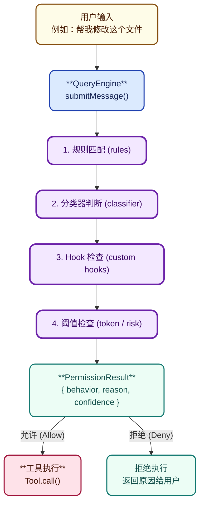

# 第七章：权限系统

## 7.1 概述

Claude Code 的权限系统是保障用户安全的关键机制，它确保 AI 执行敏感操作前得到用户授权。

**核心文件**：

- src/types/permissions.ts — 权限类型定义
- src/utils/permissions/ — 权限实现

## 7.2 权限模式

| 模式       | 说明           | 用户体验 |
| ---------- | -------------- | -------- |
| `auto`   | 自动允许/拒绝  | 无需确认 |
| `manual` | 每次询问       | 每次确认 |
| `plan`   | 计划模式更宽松 | 简化确认 |
| `yolo`   | 完全信任 AI    | 无限制   |

## 7.3 权限检查流程



## 7.4 权限规则

```typescript
type ToolPermissionRule = {
  match: string        // glob 模式，如 "Bash(git *)"
  behavior: 'allow' | 'deny' | 'ask'
}

// settings.json
{
  "permissions": {
    "alwaysAllow": [
      "Bash(git *)",
      "Read(*.ts)"
    ],
    "alwaysDeny": [
      "Bash(rm -rf /)",
      "Write(/etc/*)"
    ]
  }
}
```

## 7.5 自动分类器

```typescript
// YOLO 分类器 - 根据历史决策学习
class PermissionClassifier {
  async classify(
    tool: string,
    input: unknown
  ): Promise<'allow' | 'deny'> {
    // 基于特征的简单分类
    const features = extractFeatures(tool, input)

    // 查表历史决策
    const history = this.decisionHistory
    if (history.hasSimilar(tool, input)) {
      return history.getLastDecision()
    }

    // 默认：安全工具自动允许
    if (this.safeTools.includes(tool)) {
      return 'allow'
    }

    // 未知工具询问
    return 'ask'
  }
}
```

## 7.6 Hook 集成

```typescript
// PreToolUse Hook
type PreToolUseHook = {
  name: string
  match: string | string[]
  run(params: {
    toolName: string
    toolInput: unknown
  }): Promise<{
    allowed: boolean
    modifiedInput?: unknown
  }>
}

// Hook 执行
const result = await executePreToolUseHook({
  toolName: tool.name,
  toolInput: input,
})

if (!result.allowed) {
  return { behavior: 'deny', reason: `Hook: ${hook.name}` }
}
```

## 7.7 权限降级

```typescript
// 连续拒绝导致降级
if (this.denialCount >= DENIAL_THRESHOLD) {
  this.config.setAppState(prev => ({
    ...prev,
    toolPermissionContext: {
      ...prev.toolPermissionContext,
      mode: 'auto',  // 降级到自动模式
    },
  }))
}
```

## 7.8 总结

| 设计点              | 实现                | 价值       |
| ------------------- | ------------------- | ---------- |
| **规则匹配**  | glob 模式           | 灵活配置   |
| **自动决策**  | 分类器 + 历史       | 减少打扰   |
| **Hook 扩展** | pre/post tool hooks | 第三方集成 |
| **降级机制**  | 阈值触发            | 优雅降级   |
