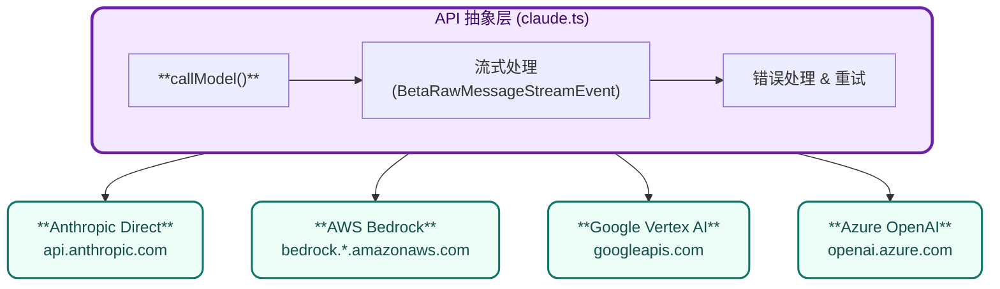

# 第八章：API 层与多 Provider 支持

## 8.1 概述

Claude Code 支持多个 LLM Provider，这是通过抽象 API 层实现的。

**核心文件**：

- src/services/api/claude.ts — API 客户端
- src/services/api/client.ts — HTTP 客户端

## 8.2 多 Provider 架构



## 8.3 Provider 选择

```typescript
// src/utils/model/providers.ts
export type ModelProvider = 'anthropic' | 'bedrock' | 'vertex' | 'azure'

export function getProviderForModel(model: string): ModelProvider {
  if (model.startsWith('claude-')) return 'anthropic'
  if (model.startsWith('amazon.')) return 'bedrock'
  if (model.startsWith('google.')) return 'vertex'
  if (model.includes('.azure')) return 'azure'
  return 'anthropic'
}
```

## 8.4 API 调用流程

```typescript
// callModel 核心流程
async function* callModel(params: CallModelParams) {
  const provider = getProviderForModel(params.model)

  // 1. 准备请求
  const request = buildRequest(params)

  // 2. 获取认证
  const auth = await getAuthForProvider(provider)

  // 3. 发送请求
  const response = await fetchWithAuth(url, auth, request)

  // 4. 处理流式响应
  for await (const line of response.body) {
    const event = parseSSEEvent(line)
    yield transformEvent(event)  // 转换为统一格式
  }
}
```

## 8.5 Anthropic Provider

```typescript
// Anthropic 直接 API
const anthropicProvider = {
  async callModel(params: AnthropicParams) {
    const response = await fetch('https://api.anthropic.com/v1/messages', {
      method: 'POST',
      headers: {
        'x-api-key': params.apiKey,
        'anthropic-version': '2023-06-01',
        'content-type': 'application/json',
      },
      body: JSON.stringify({
        model: params.model,
        messages: params.messages,
        max_tokens: params.maxTokens,
        system: params.system,
        tools: params.tools,
        stream: true,
      }),
    })

    return parseSSEStream(response.body)
  }
}
```

## 8.6 AWS Bedrock Provider

```typescript
// AWS Bedrock (Claude on SageMaker)
const bedrockProvider = {
  async callModel(params: BedrockParams) {
    // 1. 获取 AWS 凭证
    const credentials = await getAWSCredentials()

    // 2. 获取 SigV4 签名
    const signedRequest = signRequest({
      method: 'POST',
      url: `https://bedrock.${region}.amazonaws.com/model/${model}/invoke`,
      body: JSON.stringify(params),
      credentials,
    })

    // 3. 发送请求
    const response = await fetch(signedRequest.url, signedRequest)

    return parseSSEStream(response.body)
  }
}
```

## 8.7 Google Vertex Provider

```typescript
// Google Vertex AI
const vertexProvider = {
  async callModel(params: VertexParams) {
    // 1. 获取 GCP 令牌
    const token = await getGCPToken()

    // 2. 发送请求
    const response = await fetch(
      `https://${location}-aiplatform.googleapis.com/v1/projects/${project}/locations/${location}/publishers/anthropic/models/${model}:streamRawPredict`,
      {
        headers: {
          'Authorization': `Bearer ${token}`,
          'content-type': 'application/json',
        },
        body: JSON.stringify(params),
      }
    )

    return parseSSEStream(response.body)
  }
}
```

## 8.8 Azure Foundry Provider

```typescript
// Microsoft Azure AI Foundry
const azureProvider = {
  async callModel(params: AzureParams) {
    // 1. 获取 Azure AD 令牌
    const token = await getAzureToken()

    // 2. 发送请求
    const response = await fetch(
      `https://${resource}.openai.azure.com/openai/deployments/${deployment}/chat/completions?api-version=2024-06-01`,
      {
        headers: {
          'Authorization': `Bearer ${token}`,
          'content-type': 'application/json',
        },
        body: JSON.stringify(toAzureFormat(params)),
      }
    )

    return parseSSEStream(response.body)
  }
}
```

## 8.9 流式事件处理

```typescript
// 流式事件类型
type StreamEvent =
  | { type: 'message_start'; message: Message }
  | { type: 'content_block_start'; index: number; content_block: ContentBlock }
  | { type: 'content_block_delta'; index: number; delta: Delta }
  | { type: 'content_block_stop'; index: number }
  | { type: 'message_delta'; delta: Delta; usage: Usage }
  | { type: 'message_stop' }

// 处理流式事件
for await (const event of callModel(params)) {
  if (event.type === 'content_block_delta') {
    // 实时更新 UI
    yield event
  } else if (event.type === 'message_stop') {
    // 完成
  }
}
```

## 8.10 错误处理

```typescript
// 错误类型映射
const ERROR_RETRY_MAP = {
  'rate_limit_error': { retry: true, backoff: 'exponential' },
  'overloaded_error': { retry: true, backoff: 'exponential' },
  'invalid_request_error': { retry: false },
  'authentication_error': { retry: false },
}

// 错误处理
async function withRetry(fn: () => Promise<Response>) {
  let attempts = 0
  while (attempts < MAX_RETRIES) {
    try {
      const response = await fn()
      if (response.ok) return response

      const error = await response.json()
      const handling = ERROR_RETRY_MAP[error.type]

      if (!handling.retry) throw error

      await sleep(handling.backoff === 'exponential'
        ? 2 ** attempts * 1000
        : 1000)
      attempts++
    } catch (e) {
      if (attempts >= MAX_RETRIES) throw e
    }
  }
}
```

## 8.11 Token 管理

```typescript
// Token 预算追踪
interface TokenBudget {
  inputTokens: number
  outputTokens: number
  totalTokens: number
  cacheReadTokens: number
  cacheCreationTokens: number
}

// 计算预估
function estimateTokens(messages: Message[]): TokenBudget {
  let inputTokens = 0
  for (const msg of messages) {
    inputTokens += estimateMessageTokens(msg)
  }
  return { inputTokens, outputTokens: 0, ... }
}

// 预算检查
function checkBudget(budget: TokenBudget, maxBudget: number): boolean {
  return budget.totalTokens < maxBudget
}
```

## 8.12 总结

| Provider                | 认证方式         | 特点           |
| ----------------------- | ---------------- | -------------- |
| **Anthropic**     | API Key          | 最完整功能支持 |
| **AWS Bedrock**   | AWS SigV4        | 企业级安全     |
| **Google Vertex** | GCP Bearer Token | GCP 集成       |
| **Azure**         | Azure AD         | Microsoft 集成 |

| 设计点                  | 实现           | 价值       |
| ----------------------- | -------------- | ---------- |
| **Provider 抽象** | 统一接口       | 灵活切换   |
| **流式处理**      | AsyncGenerator | 低延迟响应 |
| **重试机制**      | 指数退避       | 可靠性     |
| **Token 追踪**    | 预算管理       | 成本控制   |
