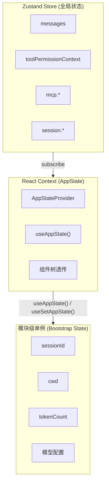
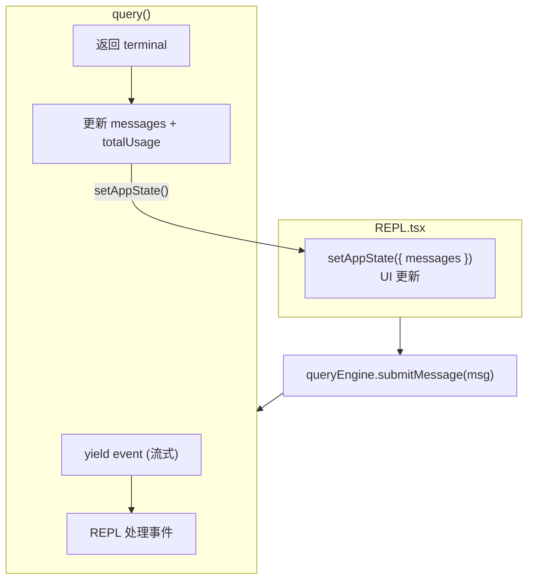

# 第十章：状态管理

## 10.1 概述

Claude Code 使用 **Zustand** 作为状态管理库，结合 React Context 和模块级单例，实现分层的状态管理。

**核心文件**：
- src/state/AppState.tsx — AppState 类型和 Provider
- src/state/store.ts — Zustand store
- src/bootstrap/state.ts — 模块级单例

## 10.2 三层状态架构



## 10.3 Zustand Store

### 10.3.1 Store 定义

```typescript
// src/state/store.ts
type State = {
  // 消息
  messages: Message[]

  // 工具
  tools: Tools
  builtinTools: Tools
  mcpTools: Tools

  // MCP
  mcp: {
    clients: MCPServerConnection[]
    resources: Record<string, ServerResource[]>
  }

  // 权限
  toolPermissionContext: ToolPermissionContext

  // 会话
  sessionId: string
  conversationId: string

  // 配置
  fastMode: boolean
  effortValue: number
  model: string
}

const store = createStore<State>((set, get) => ({
  // 初始状态
  messages: [],
  tools: [],
  // ...
}))
```

### 10.3.2 Store 方法

```typescript
// 获取状态
const messages = store.getState().messages

// 更新状态
store.setState({ messages: [...messages, newMessage] })

// 订阅变化
store.subscribe((state) => {
  console.log('messages changed:', state.messages.length)
})
```

## 10.4 AppState Context

### 10.4.1 Provider

```typescript
// src/state/AppState.tsx
const AppStateContext = React.createContext<{
  state: AppState
  setState: (updater: (prev: AppState) => AppState) => void
}>(null)

export function AppStateProvider({ children }) {
  const [state, setState] = useState(store.getState)

  useEffect(() => {
    return store.subscribe(setState)
  }, [])

  return (
    <AppStateContext.Provider value={{ state, setState }}>
      {children}
    </AppStateContext.Provider>
  )
}
```

### 10.4.2 Hooks

```typescript
// useAppState
export function useAppState(): AppState {
  return useContext(AppStateContext).state
}

// useSetAppState
export function useSetAppState(): (updater: (prev: AppState) => AppState) => void {
  return useContext(AppStateContext).setState
}
```

## 10.5 Bootstrap State

### 10.5.1 模块级单例

```typescript
// src/bootstrap/state.ts

// Session 信息
let sessionId: string | null = null
export function getSessionId(): string {
  if (!sessionId) {
    sessionId = generateUUID()
  }
  return sessionId
}

// 工作目录
let cwd: string = process.cwd()
export function getCwd(): string {
  return cwd
}
export function setCwd(newCwd: string) {
  cwd = newCwd
}

// Token 计数
let totalInputTokens = 0
let totalOutputTokens = 0

export function getTotalInputTokens(): number {
  return totalInputTokens
}

export function incrementInputTokens(count: number) {
  totalInputTokens += count
}
```

### 10.5.2 为什么用模块级单例

| 方案 | 优点 | 缺点 |
|------|------|------|
| **模块级单例** | 简单、无需 Context | 不可测试、隐藏依赖 |
| **Zustand** | 可测试、支持中间件 | 需要订阅 |
| **React Context** | React 原生 | 重渲染问题 |

Claude Code 选择**混合方案**：Zustand 用于 UI 状态，模块级单例用于基础设施状态。

## 10.6 状态更新模式

### 10.6.1 函数式更新

```typescript
// 正确：使用函数式更新
setAppState(prev => ({
  ...prev,
  messages: [...prev.messages, newMessage],
}))

// 错误：直接修改
const state = getAppState()
state.messages.push(newMessage)  // 不触发更新！
```

### 10.6.2 批量更新

```typescript
// 多个状态一起更新
setAppState(prev => ({
  ...prev,
  messages: [...prev.messages, msg1, msg2, msg3],
  totalUsage: calculateUsage(prev.totalUsage),
}))
```

## 10.7 状态持久化

### 10.7.1 会话恢复

```typescript
// 保存状态
async function saveSession() {
  const state = store.getState()
  await saveToFile({
    messages: state.messages,
    sessionId: state.sessionId,
    conversationId: state.conversationId,
    model: state.model,
  }, `${sessionDir}/state.json`)
}

// 恢复状态
async function restoreSession(snapshot: Snapshot) {
  store.setState({
    messages: snapshot.messages,
    sessionId: snapshot.sessionId,
    conversationId: snapshot.conversationId,
    model: snapshot.model,
  })
}
```

### 10.7.2 增量保存

```typescript
// 每次状态变化时保存
store.subscribe((state) => {
  debouncedSave(state)
})

// 使用防抖避免频繁写入
const debouncedSave = debounce((state) => {
  saveToFile(state, sessionFile)
}, 1000)
```

## 10.8 状态与 query.ts



## 10.9 性能优化

### 10.9.1 选择性订阅

```typescript
// 只订阅 messages 变化
const messages = useAppState(state => state.messages)

// 而不是整个 state
const state = useAppState()  // 任何变化都会触发重渲染
```

### 10.9.2 React.memo

```typescript
// 避免不必要的重渲染
const MessageRow = React.memo(function MessageRow({ message }) {
  return <div>{message.content}</div>
}, (prev, next) => {
  // 自定义比较逻辑
  return prev.message.uuid === next.message.uuid
})
```

## 10.10 总结

| 设计点 | 实现 | 价值 |
|--------|------|------|
| **Zustand** | 轻量级状态管理 | 简单、性能好 |
| **Context** | React 状态透传 | 组件树集成 |
| **模块级单例** | 基础设施状态 | 减少样板 |
| **函数式更新** | 不可变更新 | 避免 bug |
| **选择性订阅** | 状态选择器 | 性能优化 |
| **持久化** | 会话恢复 | 可靠性 |
