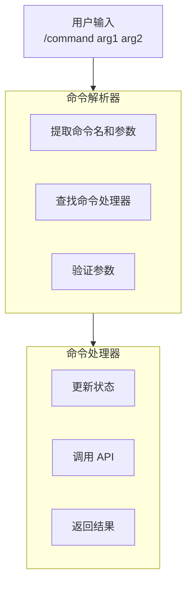

# 第十一章：斜杠命令系统

## 11.1 概述

斜杠命令是 Claude Code 用户与系统交互的主要方式之一，通过 `/command` 语法触发特殊功能。

**核心文件**：
- src/commands.ts — 命令注册
- src/commands/ — 命令实现

## 11.2 命令架构



## 11.3 命令定义

```typescript
// src/commands.ts
export type Command = {
  name: string              // 命令名
  aliases?: string[]        // 别名
  description: string       // 帮助描述
  run: CommandHandler       // 处理函数
  matcher?: RegExp          // 自定义匹配
  hidden?: boolean          // 隐藏命令
}

export type CommandHandler = (
  args: string[],
  context: CommandContext
) => Promise<CommandResult> | CommandResult
```

## 11.4 内置命令

| 命令 | 功能 | 实现文件 |
|------|------|----------|
| `/help` | 显示帮助 | commands/help/ |
| `/clear` | 清屏 | commands/clear/ |
| `/model` | 切换模型 | commands/model/ |
| `/cost` | 显示费用 | commands/cost/ |
| `/diff` | 显示变更 | commands/diff/ |
| `/plan` | 计划模式 | commands/plan/ |
| `/compact` | 压缩对话 | commands/compact/ |
| `/theme` | 主题切换 | commands/theme/ |
| `/permissions` | 权限管理 | commands/permissions/ |
| `/mcp` | MCP 管理 | commands/mcp/ |

## 11.5 命令注册

```typescript
// src/commands.ts
const commands: Command[] = []

export function registerCommand(command: Command) {
  commands.push(command)
}

export function getCommands(): Command[] {
  return commands
}

export function findCommand(name: string): Command | undefined {
  return commands.find(cmd =>
    cmd.name === name ||
    cmd.aliases?.includes(name)
  )
}
```

## 11.6 命令解析

```typescript
// 解析 "/model claude-3-opus"
function parseCommand(input: string): {
  command: string
  args: string[]
} | null {
  const match = input.match(/^\/(\w+)(?:\s+(.*))?$/)
  if (!match) return null

  return {
    command: match[1],
    args: match[2]?.split(/\s+/) ?? []
  }
}
```

## 11.7 命令执行

```typescript
// 命令执行流程
async function executeCommand(input: string) {
  const parsed = parseCommand(input)
  if (!parsed) return

  const command = findCommand(parsed.command)
  if (!command) {
    return { error: `Unknown command: ${parsed.command}` }
  }

  try {
    const result = await command.run(parsed.args, getCommandContext())
    return result
  } catch (error) {
    return { error: error.message }
  }
}
```

## 11.8 常用命令实现

### 11.8.1 /clear 命令

```typescript
const clearCommand: Command = {
  name: 'clear',
  aliases: ['cls'],
  description: 'Clear the screen and conversation history',

  async run(args, context) {
    // 清空消息
    context.setAppState(prev => ({
      ...prev,
      messages: []
    }))

    // 清屏
    return { action: 'clear_screen' }
  }
}
```

### 11.8.2 /model 命令

```typescript
const modelCommand: Command = {
  name: 'model',
  description: 'Switch the model',

  async run(args, context) {
    const [model] = args

    if (!model) {
      // 显示当前模型
      return {
        output: `Current model: ${context.model}`
      }
    }

    // 切换模型
    context.setAppState(prev => ({
      ...prev,
      model
    }))

    return {
      output: `Switched to ${model}`
    }
  }
}
```

### 11.8.3 /plan 命令

```typescript
const planCommand: Command = {
  name: 'plan',
  description: 'Enter plan mode',

  async run(args, context) {
    // 设置权限模式为 plan
    context.setAppState(prev => ({
      ...prev,
      toolPermissionContext: {
        ...prev.toolPermissionContext,
        mode: 'plan'
      }
    }))

    return {
      action: 'enter_plan_mode'
    }
  }
}
```

## 11.9 命令上下文

```typescript
type CommandContext = {
  appState: AppState
  setAppState: SetAppState
  queryEngine: QueryEngine
  tools: Tools
  mcpClients: MCPServerConnection[]
  sessionId: string
  cwd: string
}
```

## 11.10 Hook 集成

```typescript
// 命令可以注册 hooks
const hookCommand: Command = {
  name: 'hooks',
  description: 'Manage hooks',

  async run(args, context) {
    const [action, name, pattern] = args

    if (action === 'add') {
      await addHook({
        name,
        pattern,
        type: 'preToolUse'
      })
      return { output: `Added hook: ${name}` }
    }

    // ...
  }
}
```

## 11.11 命令与消息的区别

| 特性 | 斜杠命令 | 普通消息 |
|------|----------|----------|
| 触发符 | `/` | 无 |
| 处理 | 命令处理器 | AI 模型 |
| 执行位置 | 本地 | API 调用 |
| 状态变更 | 直接修改 | 通过工具调用 |
| 示例 | `/clear` | "帮我写代码" |

## 11.12 总结

| 设计点 | 实现 | 价值 |
|--------|------|------|
| **统一接口** | Command type | 一致性 |
| **别名支持** | aliases | 用户友好 |
| **参数解析** | 正则匹配 | 灵活性 |
| **命令上下文** | CommandContext | 完整信息 |
| **结果多样化** | CommandResult | 灵活输出 |
