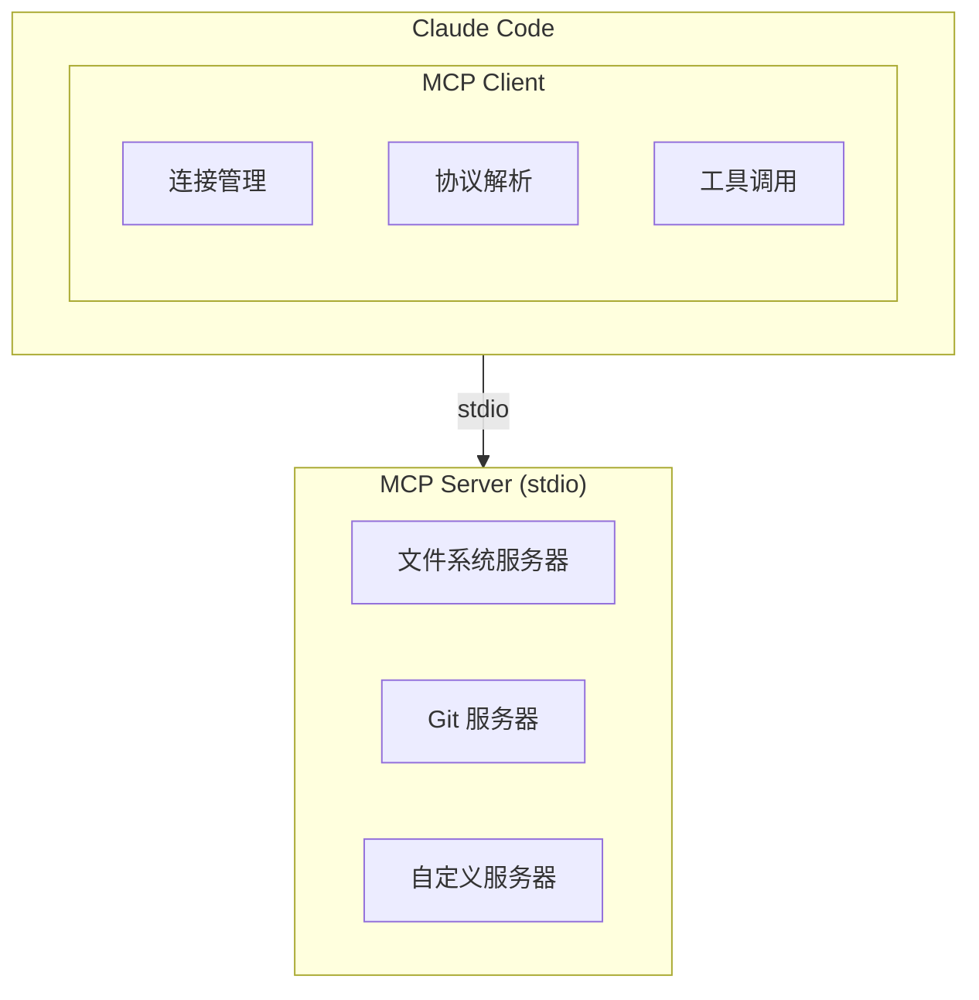
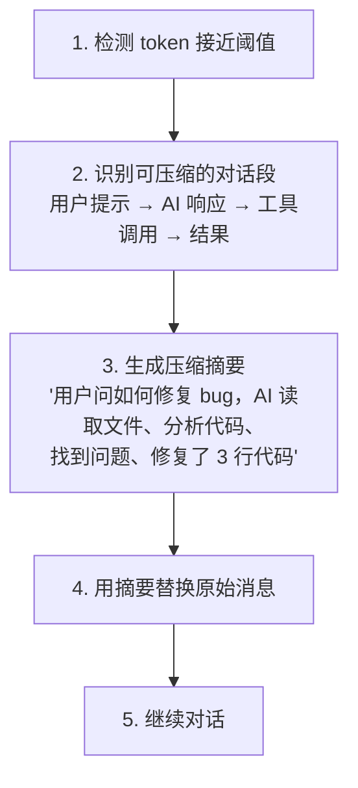

# 第十二章：高级特性

## 12.1 概述

本章介绍 Claude Code 的几个高级特性，这些功能使 Claude Code 不仅仅是一个简单的 CLI 工具。

## 12.2 MCP 协议集成

### 12.2.1 MCP 概述

MCP (Model Context Protocol) 是一种标准协议，允许 AI 模型与外部工具和服务交互。

**核心文件**：src/services/mcp/ — MCP 服务实现

### 12.2.2 MCP 架构



### 12.2.3 MCP 客户端

```typescript
// src/services/mcp/client.ts
export class MCPClient {
  private connection: Connection
  private tools: Map<string, MCPTool> = new Map()

  async connect(config: MCPClientConfig) {
    // 启动 MCP 服务器进程
    this.connection = await spawnMCPProcess(config)

    // 握手
    await this.initialize()

    // 发现工具
    await this.discoverTools()
  }

  async callTool(name: string, args: unknown): Promise<ToolResult> {
    // 发送 JSON-RPC 请求
    const response = await this.connection.send({
      jsonrpc: '2.0',
      id: generateId(),
      method: 'tools/call',
      params: { name, arguments: args }
    })

    return response.result
  }
}
```

### 12.2.4 MCP 工具适配

```typescript
// 将 MCP 工具适配到 Claude Code 的 Tool 接口
class MCPToolAdapter implements Tool {
  constructor(
    private client: MCPClient,
    private mcpTool: MCPTool
  ) {}

  get name() {
    return `mcp__${this.client.name}__${this.mcpTool.name}`
  }

  get inputSchema() {
    return z.object(
      Object.fromEntries(
        this.mcpTool.inputSchema.properties.map(p => [p.name, z.any()])
      )
    )
  }

  async call(args, context) {
    const result = await this.client.callTool(this.mcpTool.name, args)
    return { data: result }
  }
}
```

## 12.3 自动压缩机制

### 12.3.1 压缩概述

Claude Code 需要在有限的 context 窗口内工作，压缩机制通过减少历史消息来节省 token。

**核心文件**：src/services/compact/ — 压缩实现

### 12.3.2 压缩类型

| 类型 | 说明 | 触发条件 |
|------|------|----------|
| **auto-compact** | 生成摘要压缩历史 | token 超阈值 |
| **micro-compact** | 压缩缓存编辑 | 特定模式 |
| **snip** | 裁剪历史片段 | 用户触发 |

### 12.3.3 auto-compact 流程



### 12.3.4 压缩实现

```typescript
// src/services/compact/compact.ts
export async function compactMessages(
  messages: Message[],
  context: ToolUseContext
): Promise<CompactionResult> {
  // 1. 识别可压缩的消息段
  const segments = identifySegments(messages)

  // 2. 生成每个段的摘要
  const summaries = []
  for (const segment of segments) {
    const summary = await generateSummary(segment, context)
    summaries.push(summary)
  }

  // 3. 构建压缩后的消息
  const compressedMessages = buildCompressedMessages(summaries)

  // 4. 计算压缩统计
  const stats = calculateCompressionStats(messages, compressedMessages)

  return {
    messages: compressedMessages,
    summaries,
    stats,
    usage: await estimateAPICost(summaries)
  }
}
```

## 12.4 定时任务系统

### 12.4.1 Cron 工具

Claude Code 支持通过 cron 表达式创建定时任务。

**核心文件**：src/tools/ScheduleCronTool/ — Cron 工具实现

### 12.4.2 Cron 工具

```typescript
// CronCreateTool
const CronCreateTool = {
  name: 'CronCreate',

  async call(args, context) {
    const { expression, task } = args

    // 验证 cron 表达式
    if (!validateCronExpression(expression)) {
      throw new Error(`Invalid cron expression: ${expression}`)
    }

    // 创建定时任务
    const cronId = await scheduleTask({
      expression,
      task,
      sessionId: context.sessionId
    })

    return {
      data: {
        cronId,
        nextRun: calculateNextRun(expression)
      }
    }
  }
}
```

### 12.4.3 Cron 管理

```typescript
// CronListTool
const CronListTool = {
  name: 'CronList',

  async call(args, context) {
    // 获取当前会话的所有定时任务
    const tasks = await getCronTasks(context.sessionId)

    return {
      data: {
        tasks: tasks.map(t => ({
          id: t.id,
          expression: t.expression,
          task: t.task,
          nextRun: t.nextRun,
          lastRun: t.lastRun,
          status: t.status
        }))
      }
    }
  }
}
```

### 12.4.4 Cron 执行

```typescript
// 定时任务执行器
async function executeCrons() {
  const dueTasks = await getDueTasks()

  for (const task of dueTasks) {
    try {
      // 创建新的对话回合
      const engine = await createQueryEngine(task.sessionId)

      // 执行任务
      await engine.submitMessage(createUserMessage(task.task))

      // 更新状态
      await markTaskExecuted(task.id)

    } catch (error) {
      // 记录错误
      await recordTaskError(task.id, error)
    }
  }
}

// 每分钟检查一次
setInterval(executeCrons, 60_000)
```

## 12.5 子代理与团队

### 12.5.1 AgentTool

AgentTool 允许 Claude Code 派生新的子代理来并行执行任务。

**核心文件**：src/tools/AgentTool/ — 子代理实现

### 12.5.2 子代理类型

```typescript
type AgentType =
  | 'fork'    // 从当前状态分叉
  | 'async'   // 异步执行
  | 'background'  // 完全后台
  | 'remote'  // 远程执行
```

### 12.5.3 创建子代理

```typescript
// 创建 fork 子代理
const forkAgent = await createAgent({
  type: 'fork',
  prompt: 'Research alternative approaches',
  parentContext: context,  // 继承父上下文
  tools: ['Read', 'Grep', 'WebSearch']  // 限制工具
})

// 等待完成
const result = await forkAgent.waitForCompletion()
```

## 12.6 会话恢复

### 12.6.1 保存会话

```typescript
// src/utils/sessionStorage.ts
export async function saveSession(snapshot: SessionSnapshot) {
  const dir = getSessionDir(snapshot.sessionId)

  // 保存消息
  await writeFile(`${dir}/messages.json`, serializeMessages(snapshot.messages))

  // 保存文件历史
  await writeFile(`${dir}/fileHistory.json`, snapshot.fileHistory)

  // 保存元数据
  await writeFile(`${dir}/meta.json`, {
    createdAt: snapshot.createdAt,
    lastActivity: Date.now(),
    model: snapshot.model,
    totalUsage: snapshot.totalUsage
  })
}
```

### 12.6.2 恢复会话

```typescript
// src/utils/conversationRecovery.ts
export async function recoverSession(sessionId: string): Promise<SessionSnapshot> {
  const dir = getSessionDir(sessionId)

  // 读取消息
  const messages = await readMessages(`${dir}/messages.json`)

  // 读取文件历史
  const fileHistory = await readFile(`${dir}/fileHistory.json`)

  // 重建状态
  return {
    sessionId,
    messages,
    fileHistory,
    // ...
  }
}
```

## 12.7 总结

| 特性 | 实现 | 价值 |
|------|------|------|
| **MCP** | 协议适配层 | 扩展生态 |
| **压缩** | 摘要生成 | 突破 context 限制 |
| **Cron** | 定时任务 | 自动化 |
| **子代理** | 并行执行 | 效率提升 |
| **恢复** | 状态持久化 | 可靠性 |
